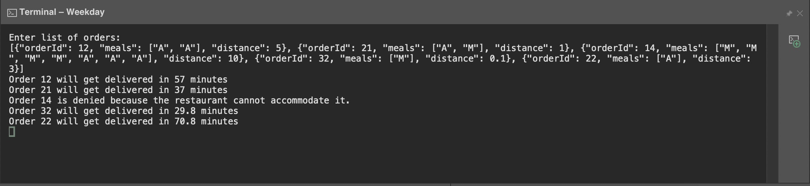

# Weekday ordering system
## Problem 1
The code takes json list input from console as a string and displays output on console.

This is how the output is displayed for the input test statement given.

## Extension of problem 1
The solution is given on the keeping following points in mind
* Creating order
* Cancel
* Edit
    * Change order Type
    * Cancel Recursive for single day
* Recursive
    * Repeat every day
    * Repeat after one week

**Select a Database you want to use to solve this problem.**
Using NoSql database (like DynamoDb) seems to be a better option as it can be modified easily later when other features for the applications require other column.

**Write down which tables you are going to make and mention the keys (primary, partition, sort keys, indexes and whichever apply to you etc)**
For this solution I'll be using two databases mainly 
1. *Order table* - will have all the columns for different things related to order like orderID,order type, list of meals etc.
2. *User table* - will have mapping of orderID and UserId.
- **order table columns**
    - order Id - This will be our primary key
    - List of Meals - Will have the list of meals of that particular ID
    - Order Type - Current/Future 
    - Order effectiveFrom - This will be used for recurring orders to get effective from and for current orders it will be current time.
    - Order End - This will be used for recurring orders to stop the recurring orders and for current orders it will be same as current *Order effectiveFrom* value.
    - interval - Repeat after how many time interval (like every 1 week or 2 week)
    - Select set of days - Applicable days (eg Monday and Tuesday)
    - List <Dates> skip - If user wants to skip the days for recurring orders(for eg weekend orders)
    - OrderStatusType → Delete(If a recurring order is cancelled), WaitingToBeFullfield(If the future recurring order hasn't started yet), Fullfield(If the recurring order reaches it's order end date),PartiallyFullfield(If the future recurring order has started but haven't reached end date yet)
- **User table**
    - UserID - ID of user
    - OrderID - OrderID of that particular user

**Write down the flow of CRUD. (Eg. When someone creates and order, what all entries will get made.) (Eg. How will you manage scheduled orders as in how will you actually go about processing them at the given time when they are saved in your table)**
For **create and order** we will have a service as ```create (Order details, userId)``` this will take order details along with userID and update out order table and user order table. Also we will store this order detail in a file for each userID in storage service(eg s3) as well in case user need ordering dates of the recurring orders till now(since this is a rare operation we will not store these things in storage service like s3 and retrive that data from there).

